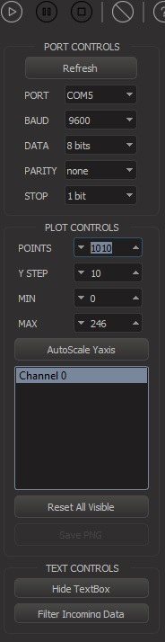

go-serial-capture
=================
### Settings
- Arduino Uno
  
### Testing project
  - [dirkarnez/arduino-uno-mic](https://github.com/dirkarnez/arduino-uno-mic)
### Tools
- https://github.com/CieNTi/serial_port_plotter/releases/download/v1.3.0/serial_port_plotter_Win_1.3.0.zip
